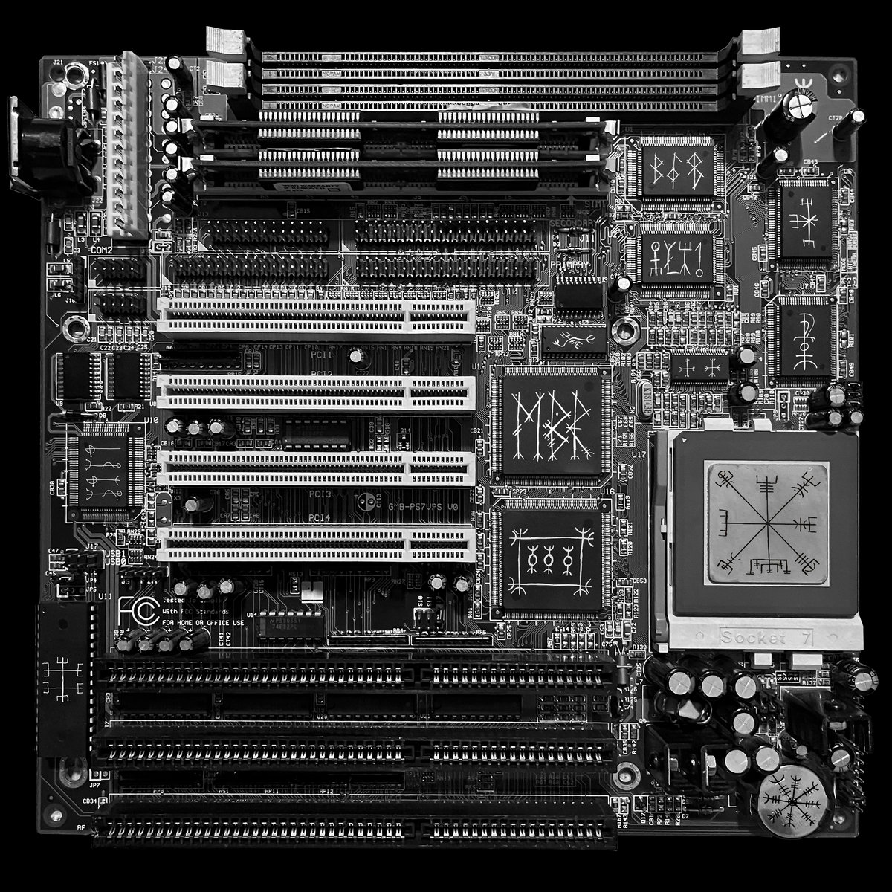

# Motherboard

One of traces is a motherboard. It is mentioned in the riddle and is on album cover.

Probably original image is from [https://theretroweb.com/motherboards/s/dtk-pam-0057v-e0-rf-rev-f](https://theretroweb.com/motherboards/s/dtk-pam-0057v-e0-rf-rev-f)

## Mobo documentation:
- [simple](motherboard%2Fgemlight-computer-ltd-pentium-gmb-p57vps-ver-3-03.html-6079d916cd2b3307837324.pdf)
- [detailed](motherboard%2Fpam-0057v-user-manual-3.03-6079d916ce0ba229334850.pdf)

## CPU 
- is a Cyrix 6x86MX-PR266 (83MHz x2.5 2.9V) - https://www.cpu-world.com/CPUs/6x86/Cyrix-6x86MX-PR266%20(83MHz%202.9V).html
- CPU speed jumpers:
  - S7: open
  - S8: closed
  - S9: open
  - S10: open
  - S11: open
  - S12: open
- Jumpers are set to Cyrix 6x86MX-PR233 200MHz 3.0x 66MHz open close open open open open
  - in factory config it should be 83MHz x2.5 = 208MHz

## Voltage
- I/O - 3.3V
- Core - 2.9V

- jumpers:
  - should be (and is on the image) set to 3.3V/2.9V:
    - S1: closed
    - S2: open
    - S3: open
    - S4: closed
    - S6: closed

## RAM

- only bank 2 is populated with SIMM modules

## Runes

On some motherboard chips there are runes.

CPU - 
